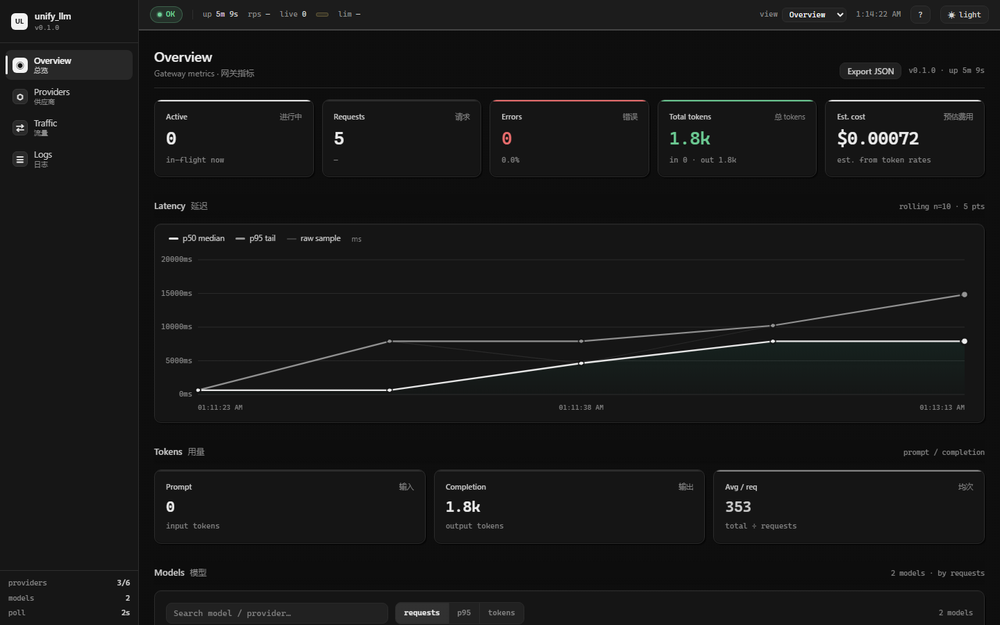
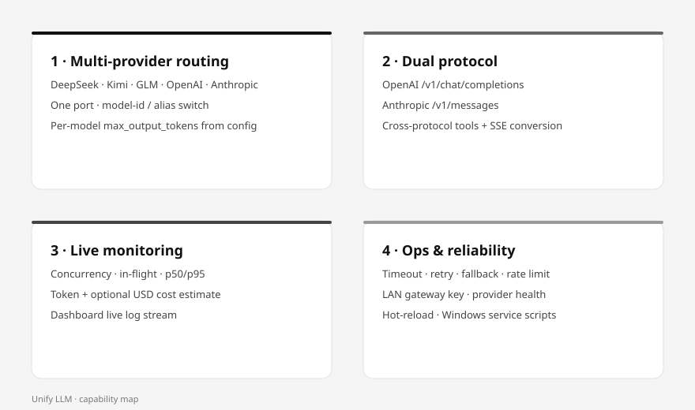

# Unify LLM

Local multi-provider LLM gateway. One fixed port routes OpenAI-compatible and Anthropic clients to DeepSeek, Kimi, GLM, and other upstreams, with concurrency monitoring and a web dashboard.

## Dashboard

Monochrome print-style UI (paper grain + stipple) with Overview / Providers / Traffic / Logs.



## Capabilities at a glance



| | |
|--|--|
| **1 Multi-provider routing** | DeepSeek, Kimi, GLM, OpenAI, Anthropic; one port; model id or alias |
| **2 Dual protocol** | OpenAI chat + Anthropic messages; cross-protocol tools and SSE |
| **3 Live monitoring** | Concurrency, in-flight, p50/p95, tokens, optional USD cost, live logs |
| **4 Ops & reliability** | Timeout/retry/fallback, rate limit, LAN key, health probes, hot-reload |

## Features

- Deploy locally and integrate multiple vendor Base URLs and API keys.
- Switch models by name (or aliases) from a single endpoint.
- Expose both protocol surfaces:
  - OpenAI: `POST /v1/chat/completions`, `GET /v1/models`
  - Anthropic: `POST /v1/messages`
- Route by model id; convert request and response bodies across protocols.
- Stream SSE end to end; recover token usage from stream chunks when available.
- Configure timeouts, retries, and an optional fallback model.
- Watch live concurrency, in-flight requests, latency (rolling p50/p95), and token totals on the dashboard.
- Optional token cost estimation (USD) from configured rates — defaults stay at 0; no vendor prices are invented.
- Optional LAN gateway key (`UNIFY_GATEWAY_KEY`) for multi-machine access on a private network.
- Multi-user API keys: issue per-user `sk-unify-…` keys for LAN machines (hashed at rest, shown once).
- User portal at `/portal`: password login, self-registration (pending approval), role separation (`admin`/`user`), own-key management.
- Optional gateway rate limits: per-client requests/minute and a global concurrency cap on `/v1/*` (HTTP 429 + `Retry-After`).
- Provider admin API: list, enable/disable, upstream test, config hot-reload.
- Dashboard ops: toggle providers, test upstream, reload config, filter logs, manage users and keys.

## Requirements

| Item | Value |
|------|--------|
| Python | 3.10 or later |
| OS | Windows, Linux, or macOS |
| Network | Reach the upstream APIs you configure |

Install dependencies:

```bash
python -m venv .venv
# Windows PowerShell
.\.venv\Scripts\Activate.ps1
# macOS / Linux
source .venv/bin/activate

python -m pip install -r requirements.txt
```

## Quick start

1. Copy the sample config and edit providers and keys:

   ```bash
   cp config.example.yaml config.yaml
   ```

   Prefer environment variables for secrets:

   ```powershell
   $env:DEEPSEEK_API_KEY = "..."
   $env:KIMI_API_KEY = "..."
   $env:GLM_API_KEY = "..."
   ```

2. Start the gateway:

   ```bash
   python main.py
   ```

   Default listen address: `http://127.0.0.1:8787`.

3. Open the dashboard:

   [http://127.0.0.1:8787/dashboard](http://127.0.0.1:8787/dashboard)

## Client setup

| Protocol | Base URL |
|----------|----------|
| OpenAI-compatible | `http://127.0.0.1:8787/v1` |
| Anthropic Messages | `http://127.0.0.1:8787` |

Anthropic clients that append `/messages` directly can also use a Base URL ending
in `/v1`. The gateway accepts `/messages`, `/v1/messages`, and `/v1/v1/messages`,
with identical API-key authentication, rate limits, and Points accounting.
Each path also supports `/count_tokens`, returning a local estimate that includes
system text, messages, tool schemas, and tool inputs. This uses roughly four
characters per token, not the upstream model's tokenizer; it is not an exact
context-limit or billing calculation, especially for non-Latin text and images.

The gateway does not authenticate local clients by default. For LAN access, set `UNIFY_GATEWAY_KEY` (see [LAN access](#lan-access)); clients then send that key as `Authorization: Bearer` or `x-api-key`. SDKs still require a non-empty API key string when auth is off; pass a placeholder such as `local`.

### OpenAI SDK

```python
from openai import OpenAI

client = OpenAI(base_url="http://127.0.0.1:8787/v1", api_key="local")
resp = client.chat.completions.create(
    model="deepseek-flash",
    messages=[{"role": "user", "content": "hello"}],
)
print(resp.choices[0].message.content)
```

### Anthropic SDK

```python
import anthropic

client = anthropic.Anthropic(base_url="http://127.0.0.1:8787", api_key="local")
msg = client.messages.create(
    model="deepseek-flash",
    max_tokens=256,
    messages=[{"role": "user", "content": "hello"}],
)
print(msg.content[0].text)
```

### curl

```bash
curl http://127.0.0.1:8787/v1/chat/completions \
  -H "Content-Type: application/json" \
  -d '{"model":"fast","messages":[{"role":"user","content":"hi"}]}'
```

## Configuration

Primary file: `config.yaml` (gitignored). Template: `config.example.yaml`.

```yaml
server:
  host: "127.0.0.1"
  port: 8787

defaults:
  timeout_seconds: 120
  max_retries: 2
  fallback_model: null

providers:
  deepseek:
    type: openai                 # openai | anthropic
    base_url: "https://api.deepseek.com"
    api_key: "${DEEPSEEK_API_KEY}"
    enabled: true
    models:
      - deepseek-flash
      - deepseek-v4-pro

aliases:
  fast: deepseek-flash
```

| Field | Notes |
|-------|--------|
| `providers.*.type` | `openai` for OpenAI-compatible chat; `anthropic` for Messages API |
| `providers.*.base_url` | Vendor base URL (see comments in `config.example.yaml`) |
| `providers.*.api_key` | Supports `${ENV_VAR}` expansion |
| `providers.*.models` | Model ids this upstream owns |
| `aliases` | Friendly name → real model id |
| `defaults.fallback_model` | Optional model used after hard upstream failure |

List the same model id under only one enabled provider. The first match wins.

## HTTP API

| Method | Path | Description |
|--------|------|-------------|
| GET | `/healthz` | Liveness |
| GET | `/dashboard` | Admin web UI |
| GET | `/portal` | User portal (login / register / keys) |
| GET | `/api/info` | Service name, version, host, auth_required |
| GET | `/api/status` | Concurrency, latency series, tokens, models |
| GET | `/api/history` | Recent completed requests |
| GET | `/api/config` | Redacted config view |
| GET | `/api/providers` | Providers (redacted) + monitor totals |
| PATCH | `/api/providers/{id}` | Toggle `enabled` (YAML write-back + in-memory) |
| POST | `/api/providers/{id}/test` | Upstream ping (`status_code`, `latency_ms`) |
| POST | `/api/admin/reload` | Hot-reload config from startup path |
| POST | `/api/auth/register` | Self-service signup (pending) |
| POST | `/api/auth/login` | Password login → session cookie |
| POST | `/api/auth/logout` | Clear session |
| GET | `/api/auth/me` | Current session user |
| GET | `/api/me/keys` | List own API keys |
| POST | `/api/me/keys` | Create own API key (raw once) |
| POST | `/api/me/keys/{id}/revoke` | Revoke own key |
| GET | `/api/me/usage` | Recent personal token/request totals |
| GET | `/v1/models` | Combined model catalog |
| POST | `/v1/chat/completions` | OpenAI chat (supports `stream`) |
| POST | `/v1/messages` | Anthropic messages (supports `stream`) |
| POST | `/v1/messages/count_tokens` | Local approximate input token count |
| POST | `/messages`, `/v1/v1/messages` | Anthropic aliases; same auth, limits and accounting |
| POST | `/messages/count_tokens`, `/v1/v1/messages/count_tokens` | Token-count aliases; same auth and rate limits |
| GET | `/docs` | Interactive OpenAPI docs |

## Monitoring

The dashboard shows:

- Active, total, and error counts
- Rolling p50 / p95 latency lines
- Prompt and completion token totals
- Per-model and per-provider breakdowns
- In-flight requests and recent history

Status JSON is available at `/api/status` for scripts or other tools.

Token totals for streaming requests are recovered from SSE `usage` fields when the upstream emits them. OpenAI-compatible streams request `stream_options.include_usage`. If a vendor omits usage, those counters stay at zero for that request.

### Persistent token totals

Lifetime totals (requests, errors, prompt/completion tokens, estimated cost) are saved to SQLite:

```text
data/unify_stats.db
```

Override the path with `UNIFY_STATS_DB`. Restarting the gateway reloads these counters. Dashboard **Clear stats** (or `POST /api/admin/clear-stats`) zeros them. **Clear logs** (`POST /api/admin/clear-logs`) only clears the live log buffer.

The `data/` directory is gitignored.

### Token cost estimation (optional)

Unify LLM does **not** pull balances from vendor consoles. It only estimates:

`cost_usd = (prompt_tokens * input_rate + completion_tokens * output_rate) / 1_000_000`

By default all rates are `0`, so **Est. cost** stays `—` even when tokens accumulate. That is expected.

1. Open each vendor’s public pricing page and copy **USD per 1M tokens**.
2. Put rates in `config.yaml` (do not commit this file):

```yaml
pricing:
  per_million_input: 0        # global fallback
  per_million_output: 0
  models:
    deepseek-flash:
      input: 0                # replace with real USD / 1M prompt tokens
      output: 0               # replace with real USD / 1M completion tokens
    kimi-k3:
      input: 0
      output: 0
    glm-5.3-flash:
      input: 0
      output: 0
```

3. Reload without restarting:

```bash
curl -X POST http://127.0.0.1:8787/api/admin/reload
```

4. Send at least one chat request, then check:

- Dashboard **Est. cost**
- `GET /api/status` → `totals.cost_usd`, `pricing.configured`
- Per provider / per model `cost_usd`

If tokens increase but cost stays `—`, rates are still zero. Stream requests only get tokens when the upstream emits `usage`.

## Develop and test

```bash
# Unit-style smoke test (no real API keys)
python scripts/smoke.py

# Proxy overhead bench against a local dummy upstream
python scripts/bench.py mock --requests 200 --concurrency 1,10,30

# Product-readiness concurrency matrix (open / user-key / queue / points)
# Uses ephemeral port + temp DBs; never touches production :8787
python scripts/bench_gateway.py --port 8799 --requests 48 --concurrency 1,8,32,64

# Live bench (uses real quota; keep counts small)
python scripts/bench.py live --model deepseek-flash --protocol openai \
  --concurrency 1,4,8 --requests 8 --max-tokens 8
```

Measured numbers and how to interpret them: see [PERFORMANCE.md](PERFORMANCE.md).

## Security

- Default bind address is `127.0.0.1` only.
- Do not expose port `8787` to the public internet without adding authentication.
- Keep API keys in environment variables or a gitignored `config.yaml`.
- `/api/config` redacts API keys; avoid sharing base URLs and model maps with untrusted parties.

## LAN access

Bind to all interfaces so other machines on the LAN can use the gateway:

```bash
python main.py --host 0.0.0.0
# or set server.host: "0.0.0.0" in config.yaml
```

Set a shared gateway key (recommended when bound to LAN):

```powershell
$env:UNIFY_GATEWAY_KEY = "change-me-long-random"
```

Or in `config.yaml`:

```yaml
auth:
  api_key: "${UNIFY_GATEWAY_KEY}"
```

When a key is set, `/v1/*` and `/api/*` require `Authorization: Bearer <key>` or `x-api-key: <key>`. `/healthz` and `/dashboard` stay open.

Other machines point at:

| Protocol | Base URL |
|----------|----------|
| OpenAI-compatible | `http://<host-ip>:8787/v1` |
| Anthropic Messages | `http://<host-ip>:8787` |
| Health / info | `http://<host-ip>:8787/healthz`, `/api/info` |

Allow inbound TCP 8787 in the host firewall for the LAN subnet only. Do not port-forward 8787 to the internet.

Print host LAN IPs and client env snippets:

```bash
python scripts/print_lan_urls.py
```

Full multi-machine guide (firewall, env vars, IDE tools, troubleshooting): [docs/LAN.md](./docs/LAN.md).

## Accounts & portal

LAN accounts support password login, roles (`admin` / `user`), and approval workflow. Per-user API keys remain hashed at rest (SHA-256) and are shown once.

### Roles and status

| Field | Values | Notes |
|-------|--------|--------|
| `role` | `admin`, `user` (default) | Admins can open `/dashboard` and `/api/admin/*` via session |
| `status` | `pending`, `active`, `disabled` | Pending/disabled cannot login or use API keys |

Passwords are stored as scrypt hashes (`scrypt$n$r$p$salt$hash`). Sessions live in SQLite (`sessions` table) and are delivered as an `HttpOnly` + `SameSite=Lax` cookie named `unify_session` (7-day expiry).

### User portal

Open [http://127.0.0.1:8787/portal](http://127.0.0.1:8787/portal):

1. **Register** — creates a `pending` account.
2. An admin **approves** the account (dashboard Users panel → Approve).
3. **Login** — session cookie; manage own API keys and view recent usage.
4. Admins see a link back to `/dashboard`. Non-admin sessions are redirected off the admin UI (client-side; APIs still enforce roles).

### Account settings

From `/portal` (any signed-in user):

| Setting | Who | Endpoint |
|---------|-----|----------|
| Display name | self | `PATCH /api/me` `{"display_name":"..."}` (empty string clears; UI falls back to login name) |
| Badge (`admin`/`vip`/`beta`/…, max 16 chars) | admin only | `PATCH /api/admin/users/{id}` `{"badge":"..."}` |
| Change password | self | `POST /api/me/password` `{"old_password","new_password"}` — **session is kept** on the current device |
| Reset password | admin | `POST /api/admin/users/{id}/password` `{"password":"..."}` — **all sessions** for that user are dropped |

Traffic / Logs **Account** columns show `display_name` (fallback: login name) plus a badge chip when set. `/api/auth/me` returns `display_name` and `badge`.

### Bootstrap the first admin

When the users DB is empty, pick one:

```bash
# CLI (recommended)
python scripts/create_admin.py --name alice --email alice@example.com
# password is prompted; or pass --password 'min-8-chars'
```

```bash
# Localhost admin API (no gateway key set)
curl -X POST http://127.0.0.1:8787/api/admin/users \
  -H "Content-Type: application/json" \
  -d '{"name":"alice","email":"alice@example.com","password":"change-me-1","role":"admin"}'
```

With a master gateway key set, create the first admin using that key:

```bash
curl -X POST http://127.0.0.1:8787/api/admin/users \
  -H "Authorization: Bearer $UNIFY_GATEWAY_KEY" \
  -H "Content-Type: application/json" \
  -d '{"name":"alice","email":"alice@example.com","password":"change-me-1","role":"admin"}'
```

### How to approve a user

1. Open **Users** on the dashboard (shortcut `5`), or call the API.
2. Find the row with status `pending`.
3. Click **Approve** — or PATCH:

```bash
curl -X PATCH http://127.0.0.1:8787/api/admin/users/<id> \
  -H "Authorization: Bearer $UNIFY_GATEWAY_KEY" \
  -H "Content-Type: application/json" \
  -d '{"approve": true}'
```

Also supported on the same PATCH: `{"role":"admin"|"user"}`, `{"status":"pending"|"active"|"disabled"}`, `{"enabled":true|false}`, `{"password":"..."}`, `{"display_name":"..."}`, `{"badge":"..."}` (badge max 16 chars).

### Admin API

Protected by the master gateway key when `UNIFY_GATEWAY_KEY` / `auth.api_key` is set, **or** by an `admin` session cookie. Without a master key, these endpoints are **localhost-only** (bootstrap).

| Method | Path | Body |
|--------|------|------|
| GET | `/api/admin/users` | — |
| POST | `/api/admin/users` | `{"name","email?","note?","password?","role?","status?"}` |
| PATCH | `/api/admin/users/{id}` | `{"approve"?,"status"?,"role"?,"enabled"?,"password"?,"display_name"?,"badge"?,"points_balance"?,"add_points"?}` |
| POST | `/api/admin/users/{id}/password` | `{"password"}` — resets password and drops that user's sessions |
| DELETE | `/api/admin/users/{id}` | — |
| GET | `/api/admin/keys` | — |
| POST | `/api/admin/keys` | `{"user_id","name?"}` → returns `raw_key` once |
| POST | `/api/admin/keys/{id}/revoke` | — |

Self-service (session cookie required):

| Method | Path | Body |
|--------|------|------|
| GET | `/api/auth/me` | — |
| PATCH | `/api/me` | `{"display_name"}` |
| POST | `/api/me/password` | `{"old_password","new_password"}` — keeps session |
| GET/POST | `/api/me/keys` | list / `{"name"?}` create (raw key once) |
| POST | `/api/me/keys/{id}/revoke` | — |
| GET | `/api/me/models` | Models the user may call (live config after hot-reload) |
| GET | `/api/me/usage` | Recent usage + `points_balance` / `points_spent` |

### Models & points

**Available models** (`GET /api/me/models`, session cookie): lists every model a signed-in user may call, read from the live `AppConfig` (updated on config reload). Each entry has `id`, `provider`, `type`, `aliases`, and optional `limits` from `model_limits`. Aliases appear as their own callable ids with `alias_of`.

**Points** are a lean per-user quota on `/v1/*` user API keys (master gateway key is never charged):

| Field | Meaning |
|-------|---------|
| `points_balance` | Remaining points. Default `0`. `-1` = unlimited |
| `points_spent` | Lifetime points deducted |

Rates live in `config.yaml` only (`limits.points_per_1k_prompt`, `limits.points_per_1k_completion`). **Both default to `0` = free** — no invented charges. Set them explicitly to enable billing:

```yaml
limits:
  points_per_1k_prompt: 0        # free prompts
  points_per_1k_completion: 1    # 1 point per 1k completion tokens
```

**Formula** (after a successful `/v1` response):

```
cost = floor(prompt_tokens/1000 * points_per_1k_prompt)
     + floor(completion_tokens/1000 * points_per_1k_completion)
# pure floor — small requests may round down to 0
```

When rates are non-zero and a user-key caller has `points_balance == 0`, the request is rejected with **HTTP 402** before the upstream call. Unlimited (`-1`) never blocks. Deduction uses actual usage tokens; stream requests deduct after the stream finishes.

Admin manage balances via `PATCH /api/admin/users/{id}`:

```bash
# set absolute balance (−1 = unlimited)
curl -X PATCH http://127.0.0.1:8787/api/admin/users/<id> \
  -H "Authorization: Bearer $UNIFY_GATEWAY_KEY" \
  -H "Content-Type: application/json" \
  -d '{"points_balance": 1000}'

# or delta (positive top-up / negative adjust)
curl -X PATCH ... -d '{"add_points": 500}'
```

The portal shows a **Points** card and **Available models** table; the dashboard Users panel has a Points column with inline Set.

### Multi-user API keys

When several machines share one gateway, give each person their own key instead of the master `UNIFY_GATEWAY_KEY`.

Keys are stored only as SHA-256 hashes in SQLite (`data/unify_users.db`, override with `UNIFY_USERS_DB`). The raw key is returned once at creation and never listed again. Format: `sk-unify-<32 hex>`.

Users can also create/revoke their own keys from `/portal` (`/api/me/keys`). API keys are only issued for `active` accounts.

### Dashboard Users panel

Open **Users** (shortcut `5`):

1. **Create user** (name, optional email/note; add `password`/`role` via API if they need portal login).
2. **Approve** pending accounts; set **Role** (`user`/`admin`); **Disable** or **Delete**.
3. **Issue key** — copy the raw key from the one-time modal.
4. Edit **display name** / **badge** inline, then **Save profile**.
5. Traffic/Logs tables show an **Account** column (display name + badge) when the request was made with a user key.

### Client auth

User keys work on `/v1/*` only (`Authorization: Bearer sk-unify-…` or `x-api-key`). They do **not** open `/api/status` or admin routes.

- Pending or disabled user, or revoked key → `401`.
- If no master key and no user keys exist, `/v1/*` stays open (backward compatible).
- Once any active user key exists, `/v1/*` requires a key (master or user).
- `/api/auth/*` stays open so the portal login page works behind a gateway key.

## Project layout

```
unify_llm/
  app.py              # FastAPI app and proxy routes
  config.py           # YAML load and validation
  registry.py         # Model → provider routing
  monitor.py          # Concurrency, tokens, latency series
  convert.py          # OpenAI ↔ Anthropic conversion
  users.py            # Users, passwords, sessions, API keys
  adapters/           # Upstream HTTP adapters
  static/dashboard.html
  static/portal.html
scripts/
  smoke.py
  bench.py
  create_admin.py
  print_lan_urls.py
main.py
config.example.yaml
DESIGN.md
DEPLOYMENT.md
docs/
  LAN.md
```

## Documentation

| Document | Purpose |
|----------|---------|
| [README.md](./README.md) | Overview and quick start |
| [DEPLOYMENT.md](./DEPLOYMENT.md) | Install, ops, systemd, troubleshooting |
| [docs/LAN.md](./docs/LAN.md) | LAN multi-machine clients, firewall, env vars |
| [DESIGN.md](./DESIGN.md) | Architecture and design decisions |
| [CONTRIBUTING.md](./CONTRIBUTING.md) | How to contribute |
| [docs/style-guide.md](./docs/style-guide.md) | Docs and commit style (Google-aligned) |

## License

Add a license file before publishing this repository publicly.
